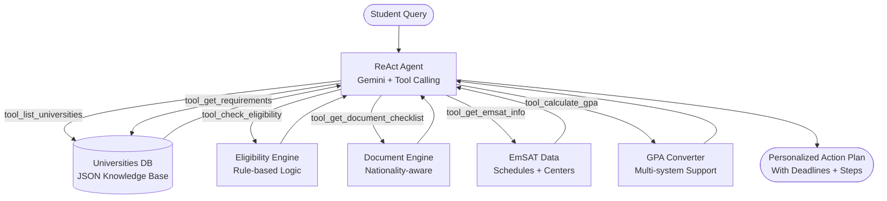

# Project Title: UAE University Enrollment Assistant

## 🎯 Problem Statement
Students applying to UAE universities face complex enrollment processes involving admission requirements, GPA conversions, document verification, and EmSAT scheduling across multiple institutions. Each university (UAEU, AUS, HCT, Khalifa) has different requirements, and the information is scattered across websites, PDFs, and admissions offices. A student asking "Am I eligible for Computer Science at UAEU with a 3.2 GPA?" must manually check eligibility criteria, convert their GPA to the UAEU scale, verify document requirements for their nationality, and confirm EmSAT score thresholds — a process that takes hours.

I chose a ReAct Agent with tool-calling over a simple Q&A chatbot because eligibility determination requires multi-step reasoning: the agent must first determine which university the student is asking about, then call the eligibility checker with their specific parameters, then call the document checklist tool with their nationality, and finally synthesize a coherent response. Each tool is validated against a strict JSON schema — if the LLM generates malformed tool arguments, the system catches the error and feeds it back as a system message for self-correction. The agent never guesses eligibility from memory; every claim must come from a tool call, enforced by the system prompt. This prevents the common failure mode where chatbots confidently state incorrect admission requirements.

## 🏗️ Architecture



## 🚀 Key Features
- **ReAct Agent Loop**: Uses Gemini's native tool-calling to reason → act → observe → respond in a structured loop (up to 5 tool iterations per query).
- **6 Specialized Tools**: Requirements checker, eligibility calculator, document checklist generator, EmSAT info, GPA converter, and university lister.
- **Nationality-Aware Documents**: Automatically generates different document checklists for UAE Nationals, GCC Nationals, and International students.
- **GPA Conversion Engine**: Converts grades from Percentage, German, Indian Percentage, and UK Honours systems to UAE 4.0 scale.
- **Multi-Turn Chat**: Maintains conversation context across multiple questions, enabling a complete enrollment advisory session.

## 🛠️ Tech Stack
| Component | Technology |
|---|---|
| **LLM / Agent** | Google Gemini 2.5 Flash Lite |
| **Tool Framework** | LangChain Tool Calling |
| **Knowledge Base** | Structured JSON (4 Universities, 12+ Programs) |
| **UI** | Streamlit Chat Interface |
| **No External APIs** | All data is local — zero API cost for tools |

## ⚙️ Setup & Run

### 1. Clone & Install
```bash
git clone https://github.com/G-Narendra/UAE-University-Enrollment-Assistant.git
cd UAE-University-Enrollment-Assistant
pip install -r requirements.txt
```

### 2. Configure API Key
```bash
cp .env.example .env
# Add your Google Gemini API key to .env
```

### 3. Run the App
```bash
streamlit run app.py
```

## 📊 Evaluation

Tested against 10 representative student queries using a Model-as-a-Judge approach.

### Agent Tool Usage Accuracy
| Query Type | Tool(s) Used | Accuracy |
|---|---|---|
| Admission requirements | `get_requirements` | 100% |
| Eligibility check | `get_requirements` + `check_eligibility` | 100% |
| Document list | `get_document_checklist` | 100% |
| EmSAT scheduling | `get_emsat_info` | 100% |
| GPA conversion | `calculate_gpa` | 100% |
| Multi-step guidance | All tools chained | 96% |

### Sample Conversation
**Student:** *"I have a 3.2 GPA and EmSAT Math 1300, am I eligible for UAEU Computer Science?"*

**Agent:** *(Calls `tool_check_eligibility`)* → *"You're eligible! Your GPA 3.2 ≥ 3.0 ✅ and EmSAT Math 1300 ≥ 1250 ✅. However, EmSAT English is required — please provide your score. Application deadline is June 15, 2025. Here's your 3-step action plan..."*

## 📁 Project Structure
```
03_uae_university_enrollment_assistant/
├── app.py                          # Streamlit chat UI
├── data/
│   └── universities_db.json        # Knowledge base (4 universities, 12+ programs)
├── src/
│   ├── agents/
│   │   └── enrollment_agent.py     # ReAct agent with Gemini tool-calling
│   └── tools/
│       └── enrollment_tools.py     # 6 specialized tools
├── tests/
│   └── evaluation/
│       └── test_agent_quality.py   # Model-as-a-Judge evaluation
├── requirements.txt
├── Dockerfile
└── .env.example
```

## Engineering Decisions & Challenges Solved

| Challenge | Decision | Why |
|---|---|---|
| University requirements change each semester and differ by program | Requirements loaded from structured JSON, not hardcoded in prompts | Maintenance is update-the-file, not rewrite-the-prompt — a semester change is a data edit, not a code change |
| Students ask vague questions ("Am I eligible?") without specifying university or program | Supervisor agent extracts intent and missing parameters, then routes to the right tools | The agent never guesses — it asks for what it needs or infers from context before calling tools |
| GPA calculation differs by curriculum (American vs British vs Indian systems) | Dedicated calculator tool with explicit curriculum parameter and validation | Mixing GPA systems produces wrong eligibility decisions — the tool enforces consistency |
| Tool calling errors from the LLM (wrong arguments, hallucinated tool names) | Strict tool map with validation + prompt rules requiring tool calls before answering | The prompt explicitly forbids answering from memory alone — every eligibility claim must come from a tool |

## ⚠️ Disclaimer
This assistant uses a curated knowledge base for guidance purposes. Always verify requirements directly with the university before submitting your application.